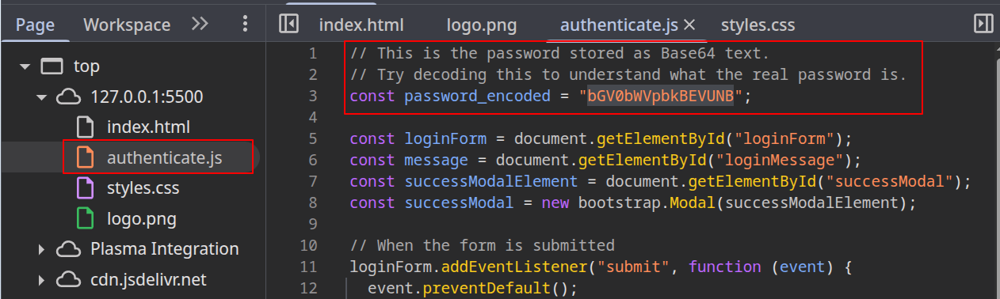
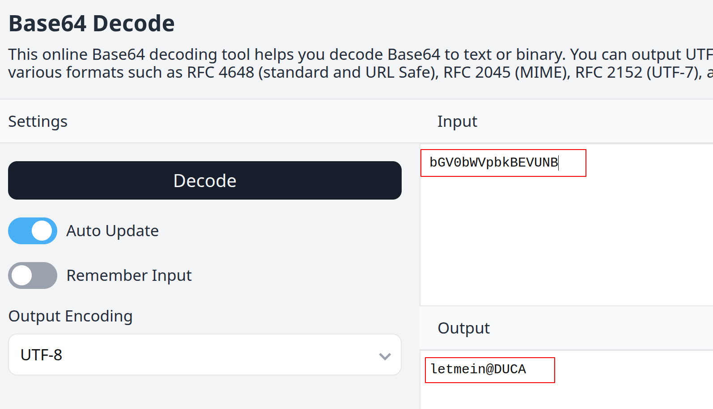

# DUCA 2026T1 CTF - Beginner Web Challenge

A very simple fully client side web CTF intended towards absolute beginners to demonstrate at our O-week stall.

Password: `letmein@DUCA`

## How to solve

1. Open `index.html` in your browser.
2. Click the hint dropdown under the login box.
3. Right click the page and click **Inspect**.
4. Open the source for `authenticate.js`.
    
5. Find the encoded password string:
   - `bGV0bWVpbkBEVUNB`
6. Decode it from Base64 (you can use browser console: `atob("bGV0bWVpbkBEVUNB")`) or use an online decoder.
    
7. Use the decoded value as the password in the login form.
8. Submit to get the success message/modal.

